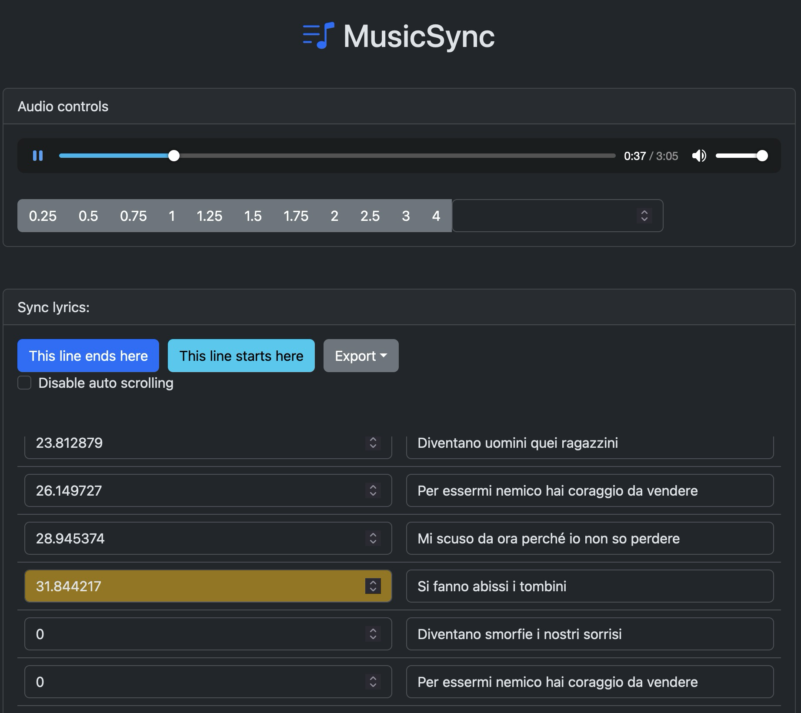

## music-sync

Create a .LRC file by manually syncronizing the audio with the text

Try it: https://dinoosauro.github.io/music-sync/

## Steps

### Choose a file

When you open the page, you'll be prompted to choose a file. You can choose to
read its metadata by using the jsmediatags library, and lyrics will
automatically be imported.

### Write the lyrics

Write, paste, or import the lyrics of the current track. You can regulate its
speed.

Also, if you have imported metadata, you'll be able to download the album art or
all the fetched metadata.

When you're done, click on the "Sync lyrics" button to start syncing them.

### Sync the lyrics

You'll find three buttons: the first will mark the current second as the end of
the line, the second will mark the current second as the start of the current
line and the third one will permit you to export everything.

You can choose between lots of available export options: the first (and most
useful) one is "Export as LRC", but you can also export in a `[{seconds}]{text}`
format, a JSON file, or only the verse or the synced seconds.

## Why this tool

I thought it could be useful as a way to learn more about using Dates. I
sometimes buy CDs of my favorite albums, and, while the sound quality is
certainly better than Spotify (let's hope Hi-Fi will come soon). However, having
synced lyrics is a really great feature, and this might be a way to replicate
it.

_I'm too lazy to sync all the lyrics of an album, so I won't actually do it
– but at least it was a cool project to make._
